---
adl_plugin:
  name: ADL Collector App Plugin
  connects_to: Manual observations typed by observers and office staff (forms, SYNOP FM-12, field web app)
  category: general
  choose_when: Your stations are manned and observations are written down or sent as SYNOP messages rather than produced by a logger.
---
# ADL Collector App Plugin

Brings **manually observed** data into ADL. Nothing is fetched from a
source: observations are typed into ADL — by office staff on a **Direct Data
Entry** form or by pasting a **SYNOP FM-12** message, and by field observers
on a mobile **Field Observer App** that works offline — and then flow through
ADL's ordinary variable-mapping, unit-conversion and QC pipeline like any
logger's data. A **Manual Observation Connection** switches those entry
surfaces on; a **Manual Observation Station Link** per station lists its
parameters, its observers and its observation schedule.

**Repository:** [adl-collector-app-plugin](https://github.com/wmo-raf/adl-collector-app-plugin)
**Plugin type identifier:** `adl_collector_app_plugin`
**Connection model:** `ManualObservationConnection` · **Station link model:** `ManualObservationStationLink`
**Other models:** `CollectorSubmission` / `CollectorSubmissionRecord` (what was typed) · `SynopMessage` (archived SYNOP) · `SynopParameterMapping` (system-wide FM-12 element → ADL parameter)

> **About the screenshots.** Every image in this guide is regenerated from
> `docs/screenshots.yml` against a seeded demo instance, so station names,
> user names and readings in them are placeholders — not values to copy. The
> field tables are the reference for what to enter.

## Overview

```
office staff ──▶ Direct Data Entry form ─┐
office staff ──▶ SYNOP FM-12 Entry ───────┼──▶ CollectorSubmission (+ one record per value)
field observer ─▶ Field Observer App ─────┘            │  queued for ingestion immediately
                                                        ▼
                     get_station_data ──▶ variable mappings ──▶ QC ──▶ ADL observations
```

A submission is stored the moment it is entered, with who entered it, when,
and for which observation time. ADL then ingests it within seconds (each
submission queues its station link for processing), and the plugin marks the
submission's records *processed* once the observations are saved. The
connection's scheduled interval is a safety net that sweeps anything left
unprocessed.

Three entry surfaces, each switched on per connection:

| Surface | Who | Where | Enabled by |
|---|---|---|---|
| **Direct Data Entry** | Any admin (staff) user | Admin page: a station picker and one input per parameter. | *Enable Office Entry* |
| **SYNOP FM-12 Entry** | Any admin user | Admin page: paste a message, decode and preview, save. The message is archived and decoded into a submission. | *Enable Office Entry* |
| **Field Observer App** | Users listed as a station's *Observers* | A separate web app (installable PWA) with its own login, station list, value form and SYNOP form; queues submissions while offline. | *Enable Field Observer App* |

SYNOP decoding uses `pymetdecoder`. A **SYNOP Parameter Mapping** table —
one row per FM-12 element, system-wide — says which ADL parameter each
decoded element feeds; a **SYNOP Setup Wizard** builds that table and the
matching station-level mappings.

## Prerequisites

- A running ADL instance (see [ADL installation](https://adl-tool.readthedocs.io/en/latest/installation.html)).
- ADL user accounts for everyone who enters data: office staff need admin
  access (they use admin pages); field observers need an ordinary ADL user
  account (username and password), which the app logs in with. See
  [Admin access](https://adl-tool.readthedocs.io/en/latest/user_guide/admin_access.html).
- For SYNOP: each station's **WMO station index** stored as the ADL
  station's *WSI local identifier* — the plugin finds the station link by
  matching the message's station id to it.
- For the field app: the ADL site reachable over HTTPS from the observers'
  phones (the app is served by ADL itself, at
  `/plugins/adl-collector-app-plugin/field-app/`).

## Installation

Installed like any ADL plugin — see [Plugin Installation](https://adl-tool.readthedocs.io/en/latest/developer_guide/plugins/plugin_installation.html)
for all methods. The `plugins.toml` entry:

```toml
[[plugins]]
name = "ADL Collector App Plugin"
git  = "https://github.com/wmo-raf/adl-collector-app-plugin.git"
tag  = "0.2.1"
```

After rebuild/restart, confirm it appears in `docker compose exec adl
list-plugins`, and that **Manual Observation Connection** is offered when
adding a connection. `pymetdecoder` is installed with the plugin.

## Connection configuration

In the ADL admin go to **Connections → Add**, choose **Manual Observation
Connection**, and fill in the base fields (name, network, plugin processing
enabled and interval, stations timezone …) as described in
[Manage Connections](https://adl-tool.readthedocs.io/en/latest/user_guide/manage_connections.html).
Plugin-specific fields:

| Field | Required | Default | Description |
|---|---|---|---|
| Enable Office Entry | no | off | Shows the *Direct Data Entry* and *SYNOP FM12 Entry* cards and row actions for this connection, and the SYNOP archive on its monitoring dashboard. |
| Enable Field Observer App | no | off | Shows the *Field Observer App* card and row action. (The app itself is served whether or not this is on; the switch controls the links.) |

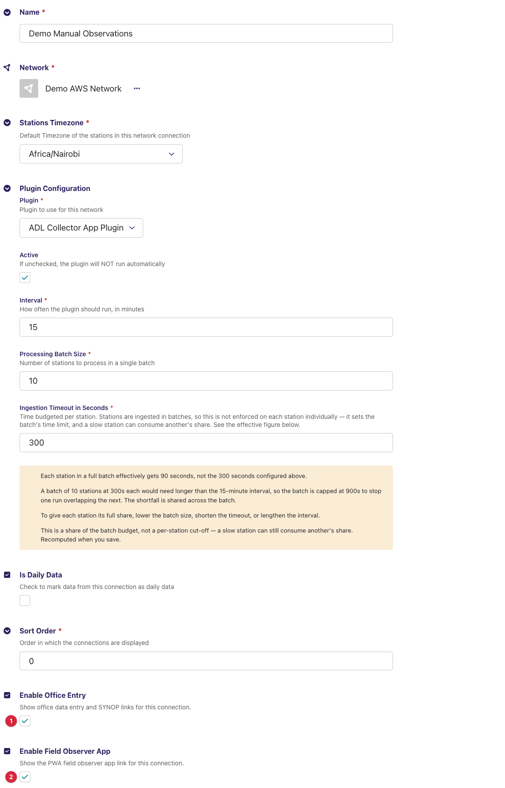

There are no connection-level variable mappings; parameters are per station.

## Station link configuration

For each station, go to **Connections → the connection → Station Links →
Add** (or *Manual Observation Station Links* in the sidebar) and create a
**Manual Observation Station Link**. Base fields (station, enabled, timezone
override, aggregation …) are the core's; plugin-specific fields:

| Field | Required | Default | Description |
|---|---|---|---|
| Collection Start Date | no | empty | Collection never starts before this date. Submissions with an observation time before it are never ingested (and stay *unprocessed* — see Troubleshooting). Must be in the past. |
| Variable Mappings | yes | — | One row per parameter the station reports (below). Rows for every system-wide SYNOP mapping are **created automatically** when a new link is saved. |
| Observers | for the field app | — | The ADL users allowed to submit for this station from the Field Observer App, each with an *Enabled* tick. Office entry does not use this list. |
| Schedule | no | empty | The station's observation schedule, one block: *Fixed Slots in Local Time* or *Windowed Only* (below). Sent to the field app as metadata; **not enforced** by this release on any entry surface. |

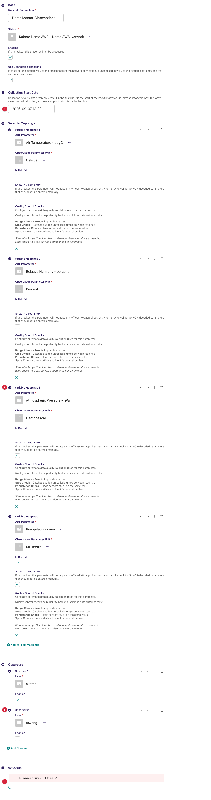

### Station variable mappings

| Field | Description |
|---|---|
| ADL Parameter | The parameter the value is stored under. Also the *key* of the value — there is no separate source name for a typed observation. |
| Observation Parameter Unit | The unit the observer enters the value in; ADL converts to the parameter's unit. |
| Is Rainfall | Marks the parameter as an accumulation; the field app labels its input *Accumulation*. |
| Show in Direct Entry | On: the parameter appears in the office form and the field app. Off: it is fed only by SYNOP decoding (the wizard sets this for coded elements). |
| Quality Control Checks | The core's QC blocks (range check …) for this parameter. A range check is also shown as a hint in the field app. |

**Example:** ADL Parameter `Air Temperature`, unit `degC`, *Show in Direct
Entry* on; ADL Parameter `Precipitation`, unit `mm`, *Is Rainfall* on.

A **coded** ADL parameter (one with *is coded* and a WMO code table set) is
entered from a drop-down of that table's codes — cloud cover in oktas,
present weather, cloud types … — instead of a number.

### Schedule blocks

| Block | Fields |
|---|---|
| Fixed Slots in Local Time | *Slots* (one or more times, default 06:00, 12:00, 18:00, 00:00; duplicates refused), *Window before/after mins* (20/20), *Grace late mins* (60), *Rounding increment mins* (5), *Backfill days* (2), *Allow future mins* (2), *Cutoff policy* (accept with late flag / reject), *Duplicate policy* (revision with reason / reject), *Lock after mins* (1440), *Rain accumulation rule*, *Accumulation day rollover local time* (06:00). |
| Windowed Only | *Window start/end* (06:00–18:00; start must precede end), then the same grace, rounding, backfill, future, cutoff, duplicate, lock, rain-rule and rollover fields. |

## Admin UI added by this plugin

The plugin adds a **Manual Stations** item to the admin sidebar (hidden
while no manual connection exists; it opens the one connection's overview,
or a chooser when there are several), a set of row actions on each Manual
Observation Connection, and the pages below.

### Entry points

On the **Network Connections** list each manual connection row carries:
**Connection Overview**, **SYNOP Setup Wizard**, **View Test Collector
Submissions**, **Monitoring Dashboard**, and — when the switches are on —
**Office Data Entry**, **SYNOP FM12 Entry**, **Field Observer App**. All open
in a new tab.

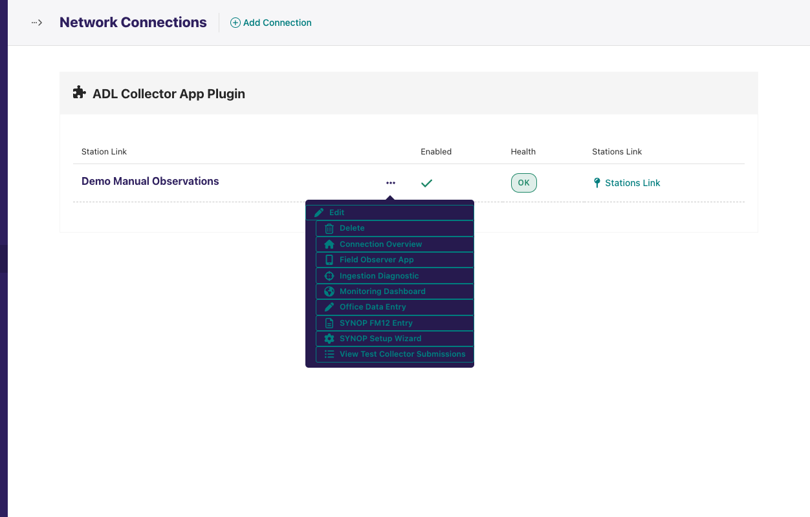

### Connection Overview

`adl-collector-app-plugin/connections/<id>/` — the landing page for one
connection, also where **Manual Stations** leads.

1. Four cards: **Monitoring**, **Direct Data Entry**, **SYNOP FM12 Entry**,
   **Field Observer App**; a card whose switch is off is greyed with *Not
   enabled*.
2. Info cards: **Station Links** (count, *View All*, *Add New*) and, with
   office entry on, **SYNOP Mapping** (the number of system-wide SYNOP
   mappings, *Setup Wizard*).
3. **Collection Status — today**: one row per enabled station with 24 hour
   cells (UTC), green where at least one non-test submission has an
   observation time in that hour. Click the station name for its detail page.

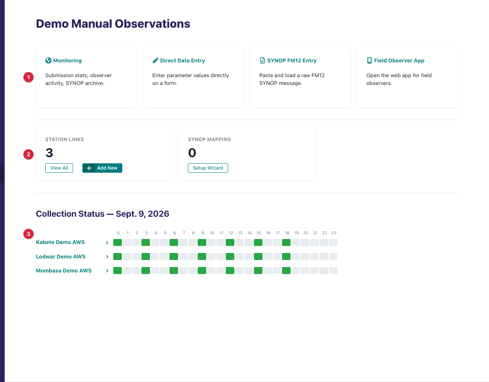

### Station detail

`…/connections/<id>/stations/<station link id>/?date=YYYY-MM-DD`. A date
filter (UTC, today by default) and a table of that day's submissions: **Obs.
Time**, one column per parameter seen that day, **Method** (*SYNOP*, *Field
Observer*, *Office Direct*) and **Edit**, which opens the matching entry form
pre-filled. Submitting the pre-filled form **creates a new submission**; the
original is kept for audit.

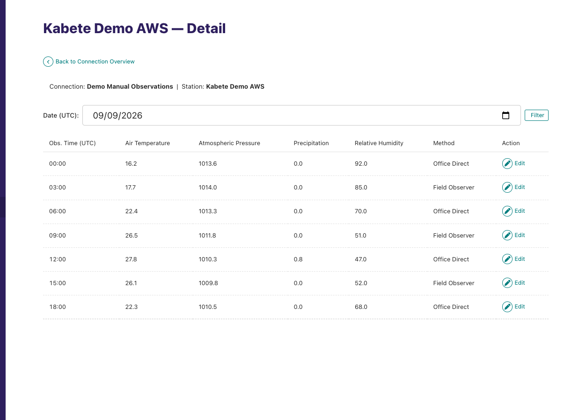

### Direct Data Entry

`adl-collector-app-plugin/office/?connection=<id>` (also reachable from the
station detail's *Edit*, with `station_link_id` and `submission_id`).

1. Pick the **Station** (every enabled manual station link on the instance).
2. Enter the **Observation Time (UTC)**; the `Z` suffix is added on submit.
3. One row per mapping with *Show in Direct Entry* on: **Parameter**,
   **Unit**, **Value** — a number input, or a drop-down of WMO codes for a
   coded parameter. Leave a value blank to omit it.
4. **Submit Observation**. Success reads `Submission #12 saved
   successfully.`; the same values for the same time by the same user read
   `Duplicate submission — already recorded.` and are not stored twice.
   Validation errors are listed above the form (`observation_time:
   observation_time cannot be in the future.` …). A station with no
   mappings shows `No variable mappings configured for this station`.

*Switch to SYNOP Entry* jumps to the SYNOP page.

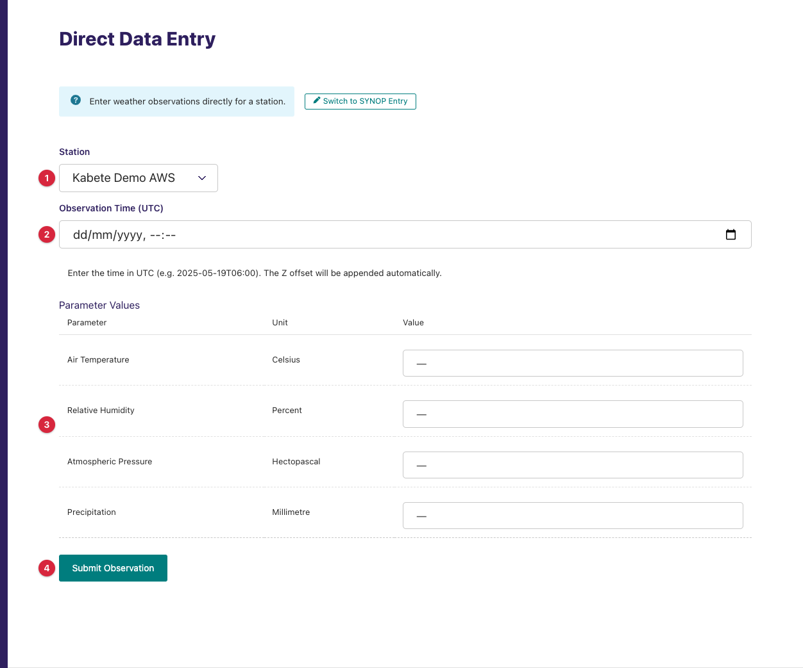

### SYNOP FM12 Entry

`adl-collector-app-plugin/office/synop/?connection=<id>`. Two steps:

**Step 1 — Entry.** *Year*, *Month* (the message carries only day and
hour) and the **Raw SYNOP FM12 Message** (`AAXX 19061 60680 …`). Press
**Decode**.

**Step 2 — Decode Preview.** A station card (station, connection, SYNOP
station id, observation time), a *Adjust year/month if incorrect* re-decode
control, then:

- **N parameter(s) will be imported** — a table of *ADL Parameter*, *FM12
  Path*, *Decoded Value*, *Source Unit* for every decoded element that has
  both a system-wide SYNOP mapping and a mapping on this station link.
- **N decoded element(s) have no ADL Parameter Mapping** — the elements
  present in the message that would be dropped, with **Map missing
  parameters** (opens the wizard with those elements pre-selected) and
  **Proceed without mapping**.
- **Save & Ingest** archives the message, creates the submission and queues
  ingestion: `SYNOP message #7 archived and queued for ingestion. Submission
  #13 created.` A message with nothing mappable reads `(No mappable
  parameters found — message archived but no observation records created.)`

A message whose station id matches no station link's WSI local identifier
shows `No station link found for SYNOP station ID "60680".`; an undecodable
message shows pymetdecoder's error under the message field.

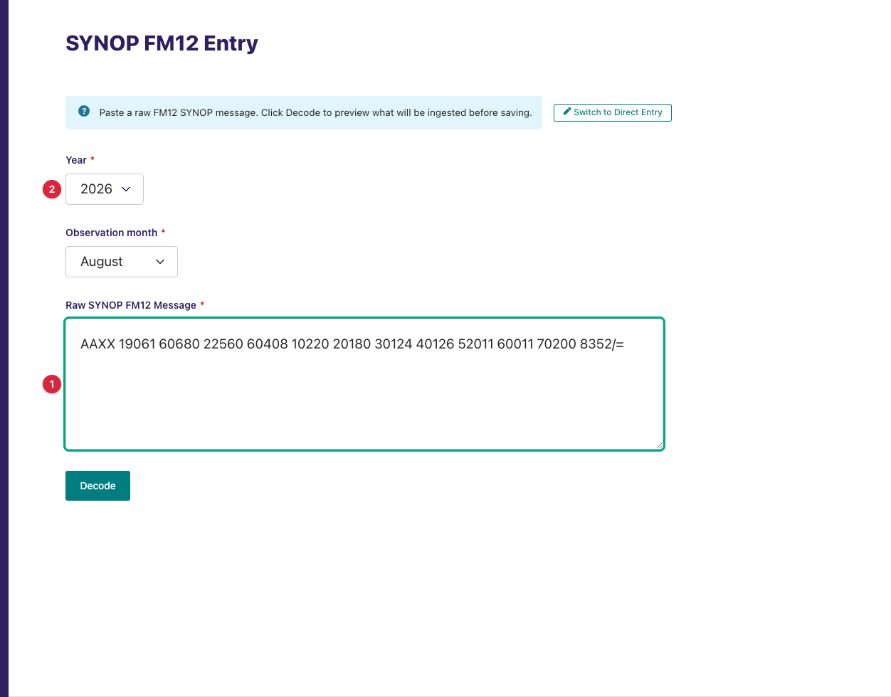

> **The decode preview is not shown, and with release 0.2.1 it cannot be
> produced.** `pymetdecoder` is declared in `requirements/base.in` but the
> compiled `requirements/base.txt` that the package installs from was built
> empty, so the library is absent and *Decode & Preview* answers
> `pymetdecoder is not installed`. This affects every 0.2.1 deployment, not
> just the demo instance — see
> [issue #14](https://github.com/wmo-raf/adl-collector-app-plugin/issues/14).
> The preview behaviour described below is what the form does once the
> dependency is installed. Office direct entry is unaffected.

### SYNOP Setup Wizard

`adl-collector-app-plugin/synop-setup/?connection=<id>` — four steps, state
kept in the session:

1. **Connection** — skipped when launched with a connection (or when only
   one exists). Warns how many common FM-12 elements have no system-wide
   mapping yet.
2. **Parameters** — one row per FM-12 element: the common set by default
   (*Show N more* adds the extended set; elements arriving from a SYNOP
   preview are grouped first as *From your SYNOP message*). Already-mapped
   rows show `✓ mapped`. For each other row choose **Use existing** (pick the
   ADL parameter and unit; auto-suggested by name where possible), **Create
   new**, or **Skip**; the *Direct Entry* tick decides *Show in Direct Entry*
   for the station mappings (off by default for coded elements).
3. **New Parameters** — for each *Create new*: name, unit symbol (must be a
   pint symbol of an existing ADL unit; `Unit symbol "…" for "…" was not
   found. Create the Unit first, then return to the wizard.` otherwise),
   category, *Is coded* with its WMO table, direct-entry tick. An existing
   parameter of the same name is reused.
4. **Confirm** — the proposed mappings and the stations that will receive
   station-level rows. **Save Mappings** creates the system-wide SYNOP
   mappings, a station mapping on every enabled station of the connection
   for each, and back-fills any older SYNOP mapping the stations lacked:
   `Saved 8 SYNOP mapping(s) and 24 station variable mapping(s) for <conn>.`
   An ADL parameter may feed only one FM-12 path; a clash is refused at this
   step.

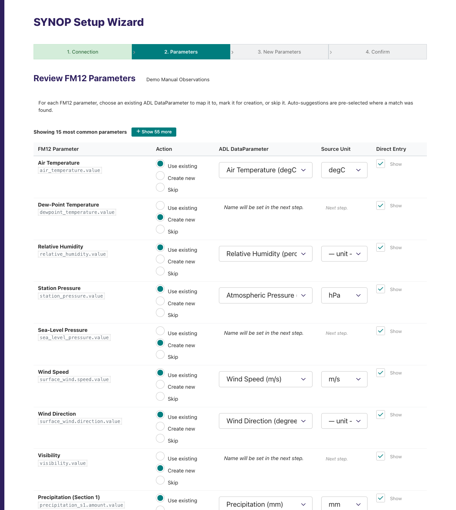

### Monitoring Dashboard

`adl-collector-app-plugin/monitoring/?connection=<id>&days=7` (a chooser
without a connection). Period buttons *Last 1 / 7 / 30 days*; a warning `N
submission record(s) are unprocessed.` with a **Trigger Collection** button
that queues every station with unprocessed records; then four panels, each
with a *View All* page that adds a date filter:

| Panel | Columns |
|---|---|
| Station Submission Status | Station, Submissions (in the period), Last Submission, Earliest Obs (with a ⚠ *Data before configured start date* tag), Latest Obs, Start Date, Status (*No data* / *Low* below 3 / *OK*). |
| Observer Activity | Observer, Station, Submissions, Last Seen — the ten most active. |
| Recent Submissions | id, Station, Observer / Staff, Observation Time, Submitted At, Source (*SYNOP* / *Office* / *Mobile*). |
| SYNOP Message Archive (office entry on) | id, Station, Submitted By, Obs Time, Received, Ingested (submission id or *No*), Raw Message. |

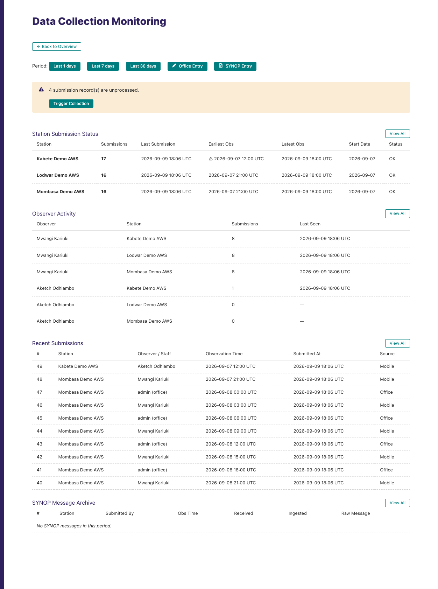

### View Test Collector Submissions

`adl-collector-app-plugin/test-collector-submissions/` lists the last 100
submissions flagged *is test submission* (the field app's API accepts the
flag; the forms do not set it). Test submissions are never ingested.

### Field Observer App

`/plugins/adl-collector-app-plugin/field-app/` — a standalone page, not the
admin. Observers open it on a phone (it installs as a PWA and registers a
service worker for offline use):

1. **Sign In** with their ADL username and password.
2. **My Stations** — the enabled station links that list them as an enabled
   observer, each with **Enter Values** and **SYNOP**.
3. **Enter Values** — *Observation Date* and *Observation Hour* (UTC), then
   one input per direct-entry mapping (unit shown; a range hint from the QC
   range check; a code drop-down for coded parameters). **Submit** sends at
   once; when offline the button reads **Save Offline** and the submission
   is queued.
4. **SYNOP** — paste the message, choose year and month, **Decode &
   Preview**, adjust, **Confirm & Submit**.
5. **Pending** — the offline queue, with *Sync now* / *Discard* per item and
   *Sync All*; the queue also flushes itself when the phone comes online.

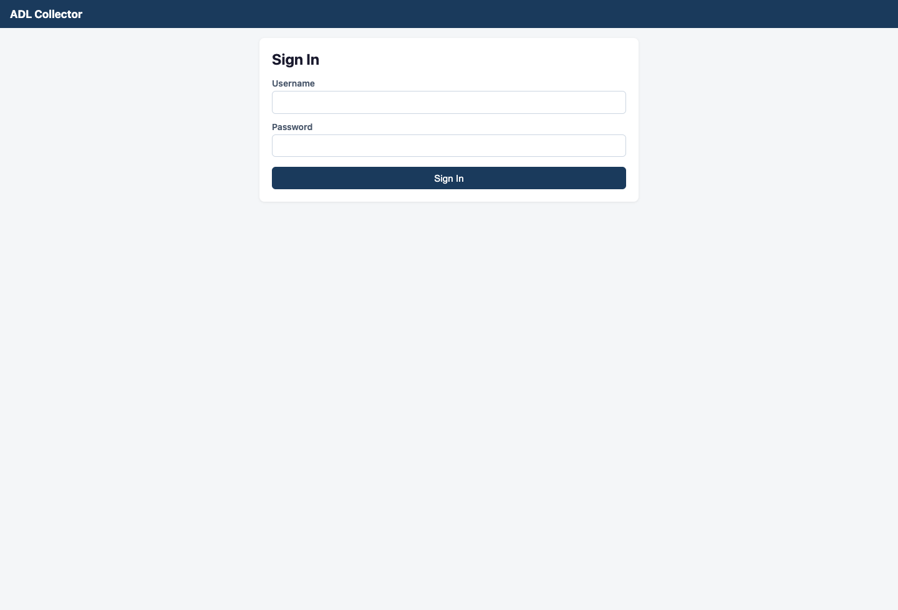

> **The value-entry screen is not shown here, and with release 0.2.1 an
> observer cannot reach it.** The app sends its token with the `Token`
> scheme, which ADL core accepts from none of its authentication classes, so
> a field observer's requests are refused. A browser that is also signed in
> to the ADL admin gets past that, but is then authenticated as the admin
> user rather than the observer, and the app reports *No stations assigned to
> you*. Steps 2–5 above describe the screens as they are designed to work;
> they are reachable once
> [issue #11](https://github.com/wmo-raf/adl-collector-app-plugin/issues/11)
> is fixed. Office entry and the SYNOP form are unaffected.

Snippets → **Collector submissions** and **SYNOP messages** expose the raw
rows for inspection.

## Data collection behavior

- **Entry:** every submission is stored immediately with its records, a
  content hash (station, observation time, values) that makes a repeated
  identical entry by the same user idempotent, and the entry pathway
  (observer or office user). A SYNOP save also stores the message and its
  full decoded JSON, and links them to the submission.
- **Ingestion:** saving a non-test submission queues its station link for
  processing at once. The plugin's collection reads every **unprocessed**,
  non-test record for the station link, groups them by observation time into
  one record per time (values keyed by ADL parameter id), and hands them to
  ADL. Once ADL has saved a batch, the records of the submissions in it are
  marked *processed*. The connection's interval re-runs this as a sweep.
- **Window:** the plugin ignores the resolved window and offers every
  unprocessed record; ADL still rejects observation times before *Collection
  Start Date* or in the future.
- **Timezones:** observation times are entered and stored in **UTC** on
  every surface (the office form appends `Z`; the app builds a `Z` time;
  SYNOP day/hour are UTC by definition). The station's timezone affects
  display and aggregation only.
- **Editing:** there is no in-place edit. *Edit* on the station detail
  pre-fills a new entry; the new submission upserts the same observation
  times, so the latest values win in the observation table while both
  submissions remain in the log.

## Source checks / diagnostics

This connection has **no external source**: the plugin declares so, and the
**Ingestion Diagnostic** page (Connections list → *Health* column) reports
its *Network path* and *Source* layers as *not applicable*, so the ladder
runs on to the **Data** layer — where observer silence, the only fault this
archetype has, is reported. The station link's **Inspect** page shows
*Collection Status* and no *Station Source Check* panel. How to read these
screens is covered in
[Monitoring & Diagnostics](https://adl-tool.readthedocs.io/en/latest/user_guide/monitoring_and_diagnostics.html).

The plugin's own health surface is the **Monitoring Dashboard** above.

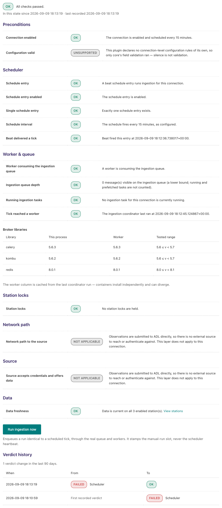

### Feedback catalogue — messages this plugin produces

| Message (example) | Where | Meaning | What to do |
|---|---|---|---|
| `Submission #12 saved successfully.` | Direct Data Entry | Stored and queued. | — |
| `Duplicate submission — already recorded.` | Direct Data Entry | The same station, time and values were already entered by this user. | Nothing; change a value if it was meant to differ. |
| `observation_time: observation_time cannot be in the future.` | Direct Data Entry / app | The time entered is later than now (UTC). | Check the hour and that it is UTC. |
| `observation_time: Datetime must include timezone info (Z or +HH:MM offset).` | API / app | A client sent a naive time. | The office form and app add `Z`; a custom client must too. |
| `Invalid station_link_id.` / `One or more variable_mapping_id values are invalid for this station link.` | API | A stale form or client. | Reload. |
| `User is not an enabled observer for this station link.` | app / API | The signed-in user is not in the station's *Observers*, or is disabled there. | Add or enable the observer on the station link. |
| `Login failed` / `No active account found with the given credentials` | app sign-in | Wrong username or password. | Reset the ADL password. |
| `No stations assigned to you.` | app | The user is an enabled observer nowhere. | Add them to the station links. |
| `Please enter at least one observation value before submitting.` | app | Empty form. | Enter a value. |
| `Could not decode SYNOP: Failed to decode SYNOP message: …` | SYNOP page / app | pymetdecoder rejected the message. | Check the groups; the text after the colon is the decoder's reason. |
| `No station link found for SYNOP station ID "60680".` / `No station link found for SYNOP station_id 60680.` | SYNOP page / app | No manual station link whose station has that WSI local identifier. | Set the ADL station's WSI local identifier to the WMO index. |
| `Message station ID '60680' does not match selected station '60681'.` | app SYNOP | The observer chose a station other than the message's. | Pick the right station. |
| `No SYNOP parameter mapping found.` | SYNOP save | The system-wide mapping table is empty. | Run the SYNOP Setup Wizard. |
| `No day found in SYNOP message.` / `No hour found in SYNOP message.` | SYNOP save | The `YYGGi` group is missing or unreadable. | Fix the message. |
| `Observation time can not be in the future. Decoded Observation Time: 2026-09-31T06:00:00+00:00` | SYNOP save | Year/month chosen put the day in the future. | Correct the month. |
| `N decoded element(s) have no ADL Parameter Mapping — these values will be not be imported if you proceed without mapping.` | SYNOP preview | Elements present but unmapped (system-wide or on this station). | *Map missing parameters*, or proceed. |
| `Synced 6 missing SYNOP variable mapping(s) across 3 station(s) for '<conn>'.` | overview (after *sync-synop* POST) | Station mappings back-filled from the system-wide table. | — |
| `N common FM12 parameter(s) do not yet have a global SYNOP mapping. The wizard will let you configure them.` | wizard step 1 | Informational. | Continue. |
| `Please select a DataParameter and Unit for "Air Temperature" or choose Skip.` | wizard step 2 | *Use existing* chosen without both selects. | Fill them or skip. |
| `ADL parameter (id=7) is already mapped to FM12 path 'air_temperature.value'. Remove or re-assign that mapping before adding another.` | wizard step 4 | One ADL parameter may feed only one FM-12 element. | Choose another parameter or remove the old mapping. |
| `N submission record(s) are unprocessed.` | Monitoring Dashboard | Records the sweep has not turned into observations yet — or never will (see Troubleshooting). | *Trigger Collection*; if the count never drops, read on. |
| `⚠ Data before configured start date` | Monitoring (Earliest Obs) | Submissions exist with observation times before the link's start date. | Move the start date back, or accept that those are never ingested. |
| `Rejected observation 2026-03-01 06:00:00+00:00 for station …: before the collection start date …` | task log (warning) | ADL core refusing such a record on every sweep. | As above. |

## Troubleshooting

**The unprocessed count never drops and *Trigger Collection* changes nothing**
: The records have observation times before the station link's *Collection
  Start Date* (or in the future). ADL rejects them on every sweep and, because
  rejected records are never marked processed, they are counted again each
  time. Move the start date back to before the earliest submission, or
  delete the submissions.

**An observer signs in to the app but sees no stations, or every submission is refused**
: The observer must be listed and *Enabled* under the station link's
  *Observers*, and the link and its connection must be enabled.

**Field app submissions fail with an authentication error after signing in, while the same user can submit from the admin**
: The app authenticates its API calls with an `Authorization: Token …`
  header, but ADL core accepts JWTs only with the `Bearer` scheme, so the
  token the app obtained is ignored; the calls succeed only when the browser
  also carries an ADL admin session cookie (a staff user who is logged in to
  the admin in the same browser). Field observers without an admin session
  cannot submit with release 0.2.1. (Defect; fix is on the app side.)

**SYNOP preview shows every element as unmapped although the wizard was run**
: The wizard creates station-level rows only for stations that existed at the
  time. For a station added later, POST *sync-synop* on the connection (the
  overview's action) or re-run the wizard, which back-fills them.

**The same observation appears twice in the station detail**
: Two submissions for the same time — an edit, or two observers. Both are
  kept; the observation table holds the latest values.

**Schedule settings have no visible effect**
: The *Schedule* block is stored and sent to the app as metadata, but no
  entry surface enforces windows, grace periods or duplicate policies in
  this release. *Max submissions per window* on the *Windowed Only* block is
  not even shown in the form (a trailing comma in the block definition
  drops it).

**Coded parameters show a free number box instead of a drop-down**
: The ADL parameter needs *is coded* on and a *WMO code table* id the plugin
  knows (2700, 0513, 0515, 0509, 4677, 4531 …). The wizard sets both when it
  creates the parameter.

## Compatibility

| Plugin version | Requires ADL core | Notes |
|---|---|---|
| 0.2.1 | 0.8.x (`has_external_source` diagnostic declaration; JWT `/api/token/` endpoint) | Current release. Installs `pymetdecoder`. Known defects: the field app's API authentication header (see Troubleshooting); the *Windowed Only* schedule block's *max submissions per window* field is dropped from the form. |

## Changelog

See [GitHub Releases](https://github.com/wmo-raf/adl-collector-app-plugin/releases).
